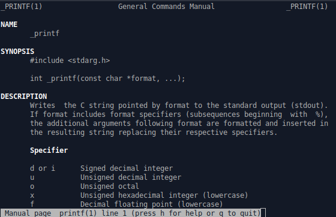

# holbertonschool-printf

## Project Description

As part of our paired project, we need to recreate the `printf` function in C, including handling the main specifiers, designing a manpage to document its usage, and creating a flowchart illustrating its internal workings.

## Description of `_printf`

The `_printf()` function formats and prints a series of characters and values to the standard output stream `stdout`. Format specifications, beginning with a percent sign (`%`), determine the output format for any argument-list following the format-string.

The format-string is read left to right. When the first format specification is found, the value of the first argument after the format-string is converted and printed according to the format specification. The second format specification causes the second argument after the format-string to be converted and printed, and so on through the end of the format-string. If there are more arguments than there are format specifications, the extra arguments are evaluated and ignored. The results are undefined if there are not enough arguments for all the format specifications.

## Usage

Your code will be compiled this way:
```sh
$ gcc -Wall -Werror -Wextra -pedantic -std=gnu89 -Wno-format *.c
```
- As a consequence, be careful not to push any c file containing a main function in the root directory of your project (you could have a test folder containing all your tests files including main functions)
- Our main files will include your main header file (main.h): #include main.h
- You might want to look at the gcc flag -Wno-format when testing with your _printf and the standard printf. 

## Requirements

- GCC compiler
- Ubuntu 20.04 LTS
- Allowed editors: vi, vim, emacs
- All your files will be compiled on Ubuntu 20.04 LTS using gcc, using the options `-Wall -Werror -Wextra -pedantic -std=gnu89`
- All your files should end with a new line
- A `README.md` file, at the root of the folder of the project is mandatory
- Your code should use the Betty style. It will be checked using `betty-style.pl` and `betty-doc.pl`
- You are not allowed to use global variables
- No more than 5 functions per file
- In the following examples, the `main.c` files are shown as examples. You can use them to test your functions, but you don’t have to push them to your repo (if you do we won’t take them into account). We will use our own `main.c` files at compilation; do not push your own `main.c` file. Our `main.c` files might be different from the one shown in the examples
- The prototypes of all your functions should be included in your header file called `main.h`
- All your header files should be include guarded
- Note that we will not provide the `_putchar` function for this project

## More information

### Authorized functions and macros

- write (man 2 write)
- malloc (man 3 malloc)
- free (man 3 free)
- va_start (man 3 va_start)
- va_end (man 3 va_end)
- va_copy (man 3 va_copy)
- va_arg (man 3 va_arg)

## Man page

Man pages are simply manual pages created to help users understand how commands are used in Linux.

### Using man page

```sh
man <what you want>
```

### Our man page



## Flowchart

## Examples

```C
function test() {
  _printf("_printf("Hello %s! You are %d years old.", "Bobby", 35);
");
}
```

Output:
```C
Hello Bobby! You are 35 years old.
```
```C
return 28;
```

## Author

This project was completed by Mathieu and Jonas.